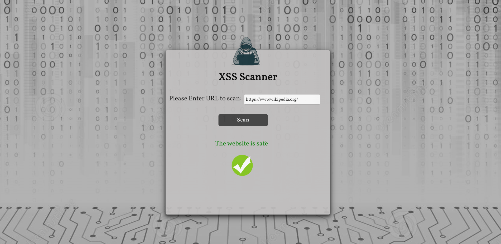

# XSS Scanner

Cross-Site Scripting (XSS) adalah salah satu kerentanan aplikasi web yang paling terkenal. Ia bahkan memiliki bab khusus dalam proyek OWASP Top 10 dan merupakan kerentanan yang sangat dicari dalam program bug bounty.

Pemindai mendapat tautan dari pengguna dan memindai situs web untuk kerentanan XSS dengan menyuntikkan skrip berbahaya di tempat input. Injeksi terjadi di browser tanpa kepala bernama Chromium dan dikendalikan oleh otomatisasi Puppeteer.

Ia bekerja dalam dua langkah:
1. Temukan target: Pada langkah pertama ini, alat mencoba mengidentifikasi semua tempat di halaman termasuk yang dapat disuntikkanparameters in forms, URLs, headers, etc.
2. Tes untuk XSS: Untuk setiap tempat yang ditemukan pada langkah sebelumnya, pemindai akan mencoba mendeteksi jika parameter rentan terhadap Pembuatan Skrip Lintas Situs. Alat ini menyuntikkan sepotong kode JavaScript, termasuk beberapa karakter HTML khusus (>, <, ", ') dan akan mencoba untuk melihat apakah dikembalikan di halaman respons tanpa sanitasi.
Jika alat mendeteksi setidaknya satu kerentanan, itu akan mengembalikan bahwa situs web tersebut memiliki kerentanan XSS.

### Teknologi
 * Puppeteer
 * Javascript
 * NodeJS
 * Express
 
 
 
### How to install

Clone the repository:
```
git clone https://github.com/MariaGarber/XSS-Scanner.git
```
Enter the clonned folder:
```
cd XSS-Scanner
```
Install the dependencies:
```
npm install
```
Run the application:
```
npm start
```
Open the browser at http://localhost:4000/
